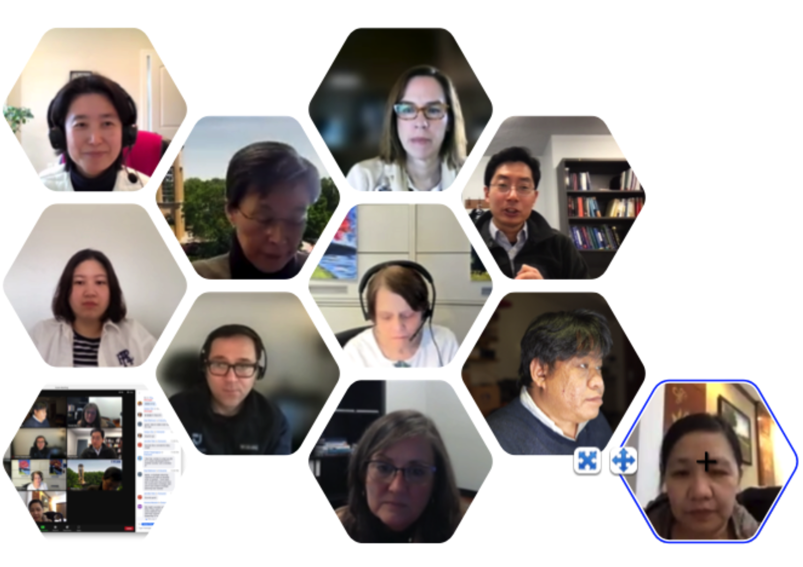

# Academy of Human Resource Development Special Interest Group Charter: Health Professions Education (HPE)

AHRD was formed to “encourage systematic study of HRD theories, processes, and practices; to disseminate information about HRD, to encourage the application of HRD research findings, and to provide opportunities for social interaction among individuals with scholarly and professional interests in HRD from multiple disciplines and from across the globe” (www.ahrd.org). The Academy’s vision is “leading the profession through research.”

Formation of Special Interest Groups (SIGs) is a mechanism to foster scholarship, dissemination of information, and fellowship among persons of similar academic and/or professional interests.

## Description of HPE SIG 
HPE SIG is a group of bridging and applying HRD with health professions education (HPE) including, but not limited to, medical education, nursing education, emergency medical technician training, veterinary medical education, hospital management, and other health-related workforce development research areas. Students, practitioners, and scholars are welcome!

## SIG Purpose
HPE SIG at AHRD aims to function as a group 
    - Promote HPE research and practice agenda among AHRD members and members in neighboring fields;
    - Collaborate on HPE research projects;
    - Exchange resources; 
    - Expand AHRD membership with HPE professionals; and 
    - Become a professional home within AHRD for those in health care.

## SIG Vision
The HPE SIG’s vision is to: 
- Create an interdisciplinary group that bridge HRD and HPE
- Contribute to the practice and research in HRD and HPE

## Scope of SIG Activities
The HPE SIG works to:
- Facilitate generating research agenda
- Support publications and scholarship 
- Nurture early-career members, including leadership development
- Promote the HPE SIG among non-members.

## Key SIG Tasks
The HPE SIG’s key tasks are to:
- Coordinate at least one activity to coincide with the AHRD International Research Conference in the Americas
- Establish and maintain a SIG listserv to foster networking, discussion, and learning for the SIG members
- Establish and maintain a SIG website within the AHRD website to promote SIG visibility and awareness
- Apply HRD theory and practice to healthcare contexts.

## SIG Roles & Responsibilities
All HPE SIG members are responsible for:
- Creating opportunities for information sharing and open discussion of SIG issues
- Participating in SIG meetings
- Participating in working groups to accomplish SIG activities
- Recruiting new SIG members 

The HPE SIG Steering Committee is responsible for:
- Ensuring that SIG members are active members of AHRD
- Overseeing all SIG activities and developing a platform for SIG members to share
- Coordinating SIG functions to promote engagement
- Communicating with SIG members and the greater AHRD community
- Provide guidance and direction for the SIG and its vision
- Establish a leadership pipeline for the SIG to ensure transition from year to year
    - It is recommended that SIGs email the Listserv with a call for nominations either late fall or in January followed by voting for positions. Then, any vacant positions can be filled at the business meeting

## Steering Committee
- Heeyoung Han (Chair), Associate Professor, Southern Illinois University School of Medicine, USA
- Dea Robinson, PhD (Chair-Elect), Affiliate Faculty, Metropolitan State University of Denver, Department of Health Professions, USA
- Pamela Barnes, Associate Professor of Leadership, Associate Dean, University of Kansas Medical Center and School of Nursing, USA
- Chungil Chae, Assistant Professor, Wenzhou-Kean University, China
- Thomas Garavan, Professor, University College Cork, Ireland
- Victoria Marsick, Professor, Teachers College, Columbia University, USA
- Dimitrios Papanagnou, Associate Dean for Faculty Development, 
- Sidney Kimmel Medical College at Thomas Jefferson University, USA
- Jennifer Park, PhD Candidate (ABD), Indiana University, USA
- Tam To Phuong, Faculty, Foreign Trade University, Vietnam
- Boyung Suh, Assistant Professor, Southern Illinois University School of Medicine, USA 
- Yonjoo Cho, Associate Professor, U of Texas at Tyler

### The HPE SIG Chair is responsible for:
- Serving as the primary point of contact for the SIG, representing the SIG to AHRD, its Board, and general membership
- Completing a twice-yearly written report of SIG activities and conveying it to the AHRD Board Liaison
- Oversee the work of the SIG
- Communicating monthly meeting agenda to the SIG members
- Plan SIG initiatives in line with the SIG Purpose and Vision

### The HPE SIG Chair-Elect is responsible for:
- Supporting the Chair in all SIG activities and responsibilities

### The HPE SIG Past Chair Is responsible for: 
- Ensuring effective transition for the newly elected Chair into their role such that the goal of the SIG is maintained.

## SIG Membership

List of SIG members (July 19, 2022)

```{r echo=FALSE, message=FALSE, warning=FALSE, paged.print=TRUE}
table1<- tibble::tribble(
                      ~Names,                                                             ~Affiliations,                                   ~Positions,                              ~Emails,  ~Countries,
              "Heeyoung Han",                         "Southern Illinois University School of Medicine",   "Associate Professor of Medical Education",                    "hhan@siumed.edu",       "USA",
             "Dea  Robinson",                                          "SCL Health/St. Mary's Hospital", "Administrative Director Inpatient Medicine",            "dearobinson80@gmail.com",       "USA",
         "Joshua C. Collins",                                     "University of Minnesota-Twin Cities",                        "Associate Professor",                   "collinsj@umn.edu",       "USA",
                "Boyung Suh",                         "Southern Illinois University School of Medicine",                        "Assistant Professor",                  "bsuh46@siumed.edu",       "USA",
             "Jennifer Park",                                                      "Indiana University",                                        "ABD",                    "jenjpark@iu.edu",       "USA",
         "Kuchinke, K Peter",                              "University of Illinois at Urbana Champaign",                         "Professor Emeritus",              "kuchinke@illinois.edu",       "USA",
                "Bob Hamlin",                                        "University of Wolverhampton (UK)",        "Professor Emeritus and Chair of HRD",               "R.G.Hamlin@wlv.ac.uk",        "UK",
                "Sehoon KIm",                                     "University of Minnesota-Twin Cities",                        "Assistant Professor",                "shkim2077@gmail.com",       "USA",
                "Jessica Li",                              "University of Illinois at Urbana Champaign",                   "Professor/Associate Dean",               "jli2011@illinois.edu",       "USA",
            "Seung Won Yoon",                                           "Texas A&M University-Commerce",                                  "Professor",            "SeungWon.Yoon@tamuc.edu",       "USA",
              "Chungil Chae",                                                 "Wenzhou-Kean University",                        "Assistant Professor",                     "cchae@kean.edu",     "China",
             "Tam To Phuong",                                                "Foreign Trade University",                                    "Faculty",             "phuongtotam@ftu.edu.vn",   "Vietnam",
             "Sunyoung Park",                                              "Louisiana State University",                        "Associate Professor",                    "spark65@lsu.edu",       "USA",
            "Thomas garavan",                                        "University College Cork, Ireland",                                  "Professor",                    "Tgaravan@ucc.ie",        "UK",
          "Victoria Marsick",                                   "Teachers College, Columbia University",                                  "Professor",            "marsick@tc.columbia.edu",       "USA",
      "Dimitrios Papanagnou",            "Sidney Kimmel Medical College at Thomas Jefferson University",     "Associate Dean for Faculty Development", "Dimitrios.Papanagnou@jefferson.edu",       "USA",
    "Katherine H Rosenbusch",                                                 "George Mason University",                        "Assistant Professor",                   "krosenbu@gmu.edu",       "USA",
             "Laura Bierema",                                                   "University of Georgia",                                  "Professor",                    "bierema@uga.edu",       "USA",
             "Carmel Kostos",                        "Dementia Australia, Centre for Dementia Learning",                                "Facilitator",   "Dr.Carmel.Kostos@dementia.org.au", "Australia",
                "Yonjoo Cho",                                                     "U of Texas at Tyler",                        "Associate Professor",                   "ycho@uttyler.edu",       "USA",
              "Urvashi Vaid",            "Sidney Kimmel Medical College at Thomas Jefferson University",                                           NA,         "Urvashi.Vaid@jefferson.edu",       "USA",
             "Changkyu Kwon",                                                      "Oakland University",                        "Assistant Professor",                  "ckwon@oakland.edu",       "USA",
               "Merel Visse", "Drew University, Medical and Health Humanities Program, Drew University",                        "Associate Professor",                    "mvisse@drew.edu",       "USA",
              "Pallvi Arora",                                                     "University of Jammu",                        "Assistant Professor",           "pallvi.arora12@gmail.com",     "India",
             "Melissa Lomas",               "The University of Southern Mississippi Graduate Assistant",                                           NA,              "Melissa.Queen@usm.edu",       "USA",
       "Andrew Sanghyun Lee",                         "Southern Illinois University School of Medicine",                       "Post Doctoral Fellow",                  "slee26@siumed.edu",       "USA"
    )
knitr::kable(table1)
```

- https://docs.google.com/spreadsheets/d/1i3MvxG24yyU0YQbPTOyX9Fe1LPmx41GKAw0n9S_XVDA/edit#gid=0

## Provisions for electing the SIG Chairs

- **Chairs**
    - The Chair serves a one-year term followed by a one-year term as Past-Chair of the committee. 

- **Chair-Elect**
    - The Chair-Elect serves one year, followed by a one-year term as Chair of the Section and by a one-year term as Past-Chair.

- **Past Chair**
    - The Past Chair serves a one-year term. 

**Elections**

- All HPE SIG members are eligible for the Chair position. The Chair will send out a call for nominations, including self-nomination, one month before the AHRD meeting. 

- Election for the Chair-Elect position will be held yearly at AHRD

**Other**

- Provisions for electing the SIG Chair, including the length of time any officer can serve and procedures for SIG membership to challenge and remove any Chair who is not performing his/her roles and responsibilities.

- Provisions for electing/identifying SIG Steering Committee Members, including the length of time any officer can serve and procedures for SIG membership to challenge and remove any Steering Committee Member who is not performing his/her roles and responsibilities.

- Provisions for electing/identifying any other SIG leadership officer, including the length of time the officer can serve and procedures for SIG membership to challenge and remove the SIG leadership officer who is not performing his/her roles and responsibilities.
 

